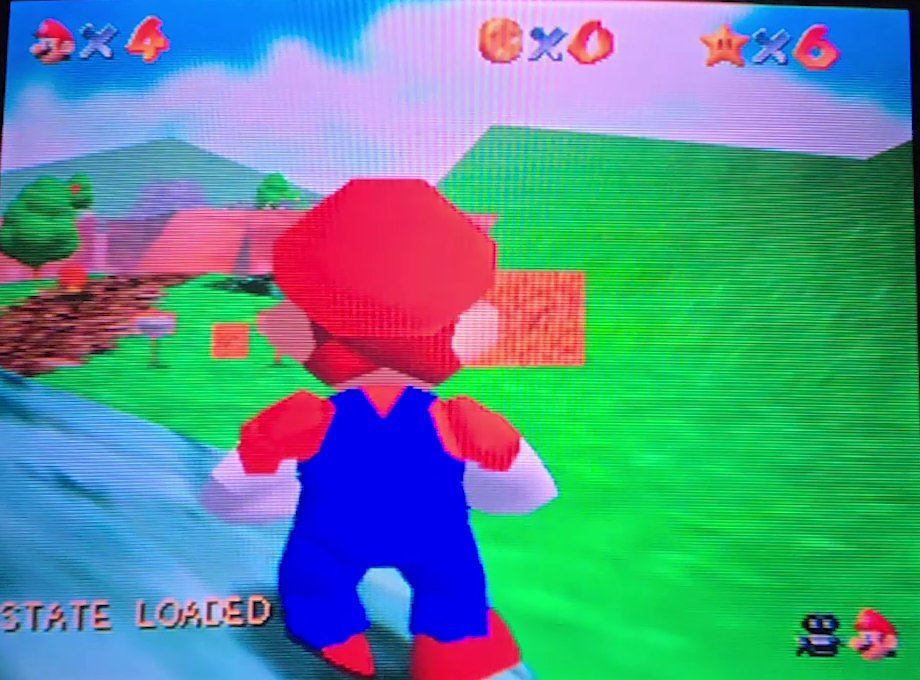
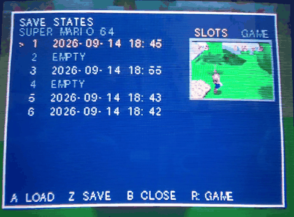

# Save states for the SummerCart64 (N64FlashcartMenu fork)

**[Watch the demo (4½ minutes)](https://www.youtube.com/watch?v=yBQcb5c4tq0)**: the options, the slot panel, a load, slow motion,
suspend and resume, on the console.

This fork adds, for the SummerCart64:

- **Save states.** Hold L + R + D-pad Up in a game to save, L + R + D-pad Down to
  load, L + R + Start for a slot panel with thumbnails; states persist on the SD card.
  Nothing stays resident in the console's memory, so games that use the whole
  Expansion Pak work too.
- **A virtual Controller Pak (memory pak).** A game that uses one gets a pak that lives
  on the SD card, whether or not a real one is plugged in; on by default for the games
  known to use one.
- **Suspend and resume.** Suspend a game to a slot from the panel and switch the
  console off; the next launch of that game picks up where you left it.
- **Slow motion and frame step**, as a per-game option.

It needs an Expansion Pak and works with 276 of the 298 games tried so far.

- **[Save states: setup, usage, compatibility, how it works](docs/savestates.md)**
- Download `sc64menu.n64` from the Releases page, copy it to the root of the SD card,
  then switch **Save States** on per game in the ROM's options.

Not affiliated with or endorsed by Nintendo. This is a fork of the open-source
N64FlashcartMenu (AGPL-3.0); it ships no game data of any kind.

Everything below is the unchanged upstream README.

---

# N64FlashcartMenu
An open source menu for N64 flashcarts that aims to support as many as possible.  
This menu is not affiliated with any particular flashcart and does not necessarily expose all possible firmware features.

> [!TIP]
> Help sponsor development [NetworkFusion on Ko-Fi](https://ko-fi.com/networkfusion). Or submit your Pull Request.

> [!TIP]
> New users are invited to read the latest [Documentation / User Guide](./docs/00_index.md).

## Flashcart Support
This menu aims to support as many N64 flashcarts as possible.  
The current state of support is:

### Supported
* SummerCart64
* 64Drive

### Work in Progress
* EverDrive-64 (X and V series)
* ED64P (clones)

### Not yet planned
* Doctor V64
* PicoCart
* DaisyDrive

## Current (notable) menu features
* Fully Open Source.
* Loads all known N64 games, even if they are byteswapped.
* Fully emulates the 64DD and loads 64DD disks (SummerCart64 only).
* Emulator support (NES, SNES, GB, GBC, SMS, GG, CHF) ROMs.
* N64 ROM box art image support.
* Background image (PNG) support.
* Comprehensive ROM save database (including homebrew headers).
* Comprehensive ROM information display.
* Real Time Clock support.
* Music playback (MP3).
* Menu sound effects.
* N64 ROM fast reboot option (on reset).
* ROM history and favorites.  

Experimental (beta):
* ROM Datel code editor.
* Zip archive browsing and file extraction.
* Controller Pak backup and restore (including individual notes).
* Game art image switching.

## Aims
* Support as many N64 Flashcarts as possible.
* Be open source, using permissively licensed third-party libraries.
* Be testable in an emulated environment (Ares).
* Encourage active development from community members and N64 FlashCart owners.
* Support as many common mods and features as possible (flashcart dependent).

## Flashcart specific information

### SummerCart64
Download the latest `sc64menu.n64` file from the [releases](https://github.com/Polprzewodnikowy/N64FlashcartMenu/releases/) page, then put it in the root directory of your SD card.  
  
> [!TIP]
> A quick video tutorial can be found here:
>
> 

### 64drive
* Ensure the cart has the latest [firmware](https://64drive.retroactive.be/support.php) installed.
* Download the latest `menu.bin` file from the [releases](https://github.com/Polprzewodnikowy/N64FlashcartMenu/releases/) page, then put it in the root directory of your SD card.

# Contributors
The features in this project were made possible by the [contributors](https://github.com/Polprzewodnikowy/N64FlashcartMenu/graphs/contributors).

# License
This project is released under the [GNU AFFERO GENERAL PUBLIC LICENSE](LICENSE.md) as compatible with all other dependent project licenses.  
Other license options may be available upon request with permissions of the original `N64FlashcartMenu` project authors / maintainers.  
* [Mateusz Faderewski / Polprzewodnikowy](https://github.com/Polprzewodnikowy)
* [Robin Jones / NetworkFusion](https://github.com/networkfusion)

# Open source software and licenses used
## Libraries
* [libdragon](https://github.com/DragonMinded/libdragon/tree/preview) - [UNLICENSE License](https://github.com/DragonMinded/libdragon/blob/preview/LICENSE.md)
* [libspng](https://github.com/randy408/libspng) - [BSD 2-Clause License](https://github.com/randy408/libspng/blob/master/LICENSE)
* [minimp3](https://github.com/lieff/minimp3) - [CC0 1.0 Universal](https://github.com/lieff/minimp3/blob/master/LICENSE)
* [miniz](https://github.com/richgel999/miniz) - [MIT License](https://github.com/richgel999/miniz/blob/master/LICENSE)
* [dr_flac](https://github.com/mackron/dr_libs) - [MIT License](https://github.com/mackron/dr_libs/blob/master/LICENSE)

## Sounds
See [License](https://pixabay.com/en/service/license-summary/) for the following sounds:
* [Cursor sound](https://pixabay.com/en/sound-effects/click-buttons-ui-menu-sounds-effects-button-7-203601/) by Skyscraper_seven (Free to use)
* [Actions (Enter, Back) sound](https://pixabay.com/en/sound-effects/menu-button-user-interface-pack-190041/) by Liecio (Free to use)
* [Error sound](https://pixabay.com/en/sound-effects/error-call-to-attention-129258/) by Universfield (Free to use)

See [License](https://creativecommons.org/licenses/by/4.0/) for the following sounds:
* [Background Music](https://www.playonloop.com/2017-music-loops/flying-dreams/) POL-flying-dreams-short

## Emulators
* [neon64v2](https://github.com/hcs64/neon64v2) by *hcs64* - [ISC License](https://github.com/hcs64/neon64v2/blob/master/LICENSE.txt)
* [sodium64](https://github.com/Hydr8gon/sodium64) by *Hydr8gon* - [GPL-3.0 License](https://github.com/Hydr8gon/sodium64/blob/master/LICENSE)
* [gb64](https://github.com/lambertjamesd/gb64) by *lambertjamesd* - [MIT License](https://github.com/lambertjamesd/gb64/blob/master/LICENSE)
* [smsPlus64](https://github.com/fhoedemakers/smsplus64) by *fhoedmakers* - [GPL-3.0 License](https://github.com/fhoedemakers/smsplus64/blob/main/LICENSE)
* [Press-F-Ultra](https://github.com/celerizer/Press-F-Ultra) by *celerizer* - [MIT License](https://github.com/celerizer/Press-F-Ultra/blob/master/LICENSE)

## Fonts
* [Firple](https://github.com/negset/Firple) by *negset* - (SIL Open Font License 1.1)
